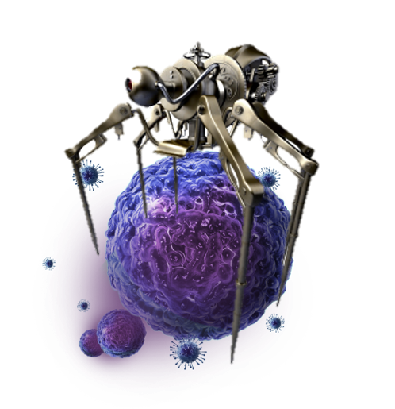
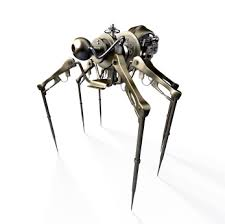

  <h1 style="color:Black;"> 
  <b>
  

  
   Robocytes
      
  

  </b>
  </h1>
<h2>
 

<html>
<body>

</body>
</html>

<i> Lymphocytes on Steroids! </i>
</h2>

 - Robocytes are the answer to uprising epidemics affecting third world countries and even parts of the eastern and western societies, these robotic lymphocytes are guaranteed to preserve and prolong the lifespan of the humans they assist.
 

<h2> 

 
 3 Rules Of a Robot 
 

</h2>

<h3>1. <strong> I will cause no harm to my human</strong> </h3>
Robocytes encode the genetic code of their host they are encrypted to self destruct if ever programmed to kill the blood cells of the host.
<h3>2. <strong> I will do no harm to myself </strong> </h3>
Robocytes perform systematic cleansing to calibrate and perform their daily task, their hardware is designed to outlast 105 years. 
<h3>3. <strong> I will do no harm to my environment </strong> </h3>
These microscopic robots leave no traces in the human body , when dormant they circulate through the body like blood cells. 

<html>
<body>

</body>
</html>

### Our Mission 

We aspire to preserve the lives of billions through this vaccination that will kill off bacteria and viruses that could not be identified or cured. 

