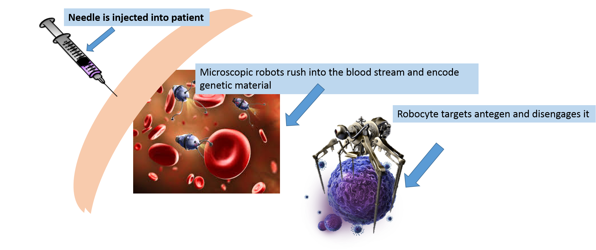

## How They Work

A serum is injected into the arm of the patient, the robotic lymphocytes immediately disperse through the bloodstream mainly venturing to the spleen, tonsils and lymph nodes where the initial immune response is likely to occur. The robocytes by then have encoded the body's genetic material.
<html>
<body>

</body>
</html> 
The robocytes perform bodily circulations that ensures the body's chemistry is stable and uninterrupted by external invasions. The robocytes are dormat until a possible threat is detected. If a bacteria or virus enters the body the robocytes take approximately .2 seconds to detect this and immediately attack and act as a parasite, latching onto the bacteria and disengaging it.    Whenever you commit to this repository,

### Contact

 Check out our [documentation](https://www.cdc.gov/
) or [contact support](https://github.com/TruthSerum/truthserum.github.io/blob/master/Faq.md

) and we’ll help you sort out difficulties.
